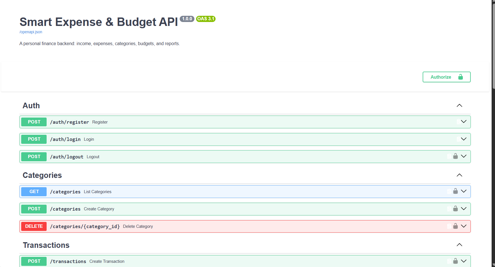
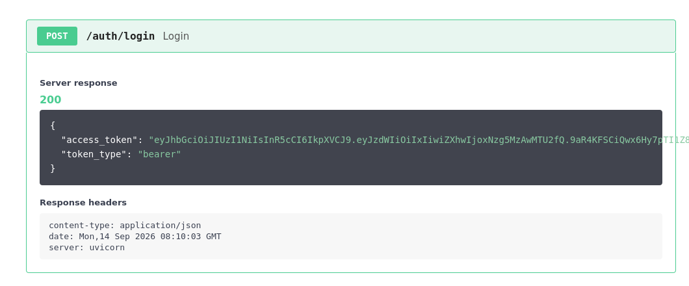
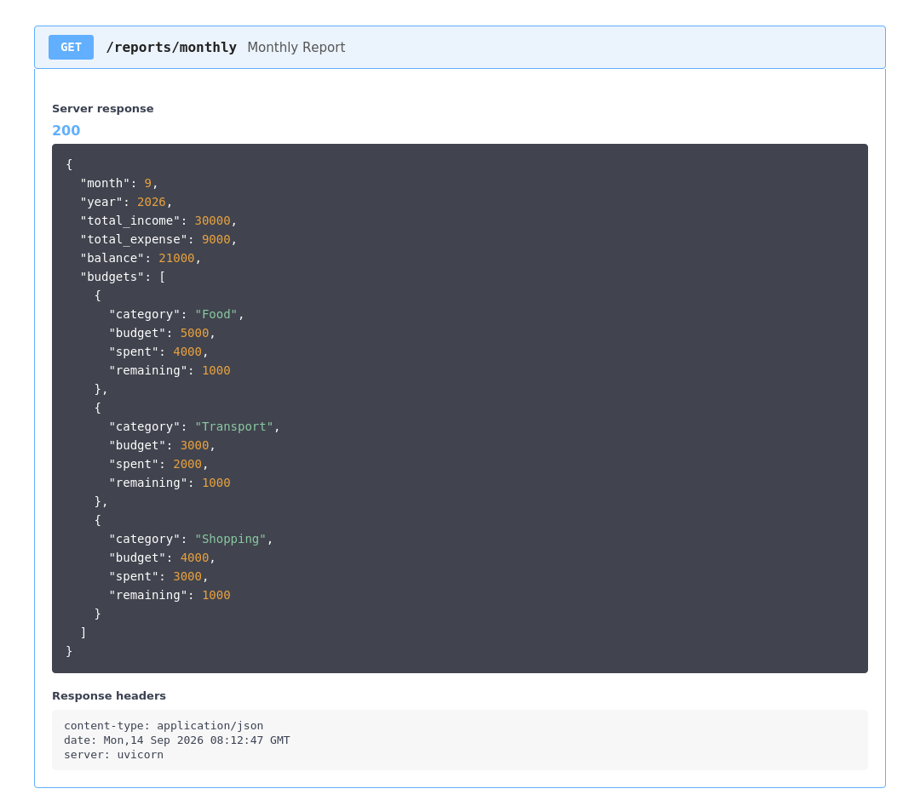

# Smart Expense & Budget API

A personal finance backend built with FastAPI, MySQL, SQLAlchemy, and JWT auth.
Manage income, expenses, categories, monthly budgets, and see spending reports.

## Architecture & Data Flow

The following diagram shows both the database relationships and the complete request flow from the client through FastAPI, authentication, validation, router logic, SQLAlchemy, and the MySQL database.

<p align="center">
  
</p>

## Project Showcase

### 1. Interactive API Documentation

The project includes interactive Swagger/OpenAPI documentation for testing and exploring the available endpoints.

<p align="center">
  
</p>

### 2. JWT Login

The login endpoint authenticates the user and returns a JWT bearer access token that is used to access protected endpoints.

<p align="center">
  
</p>

### 3. Monthly Financial Report

The monthly report endpoint combines income, expenses, and category budgets to return a clear financial summary, including budget, spent, and remaining amounts per category.

<p align="center">
  
</p>

## Documentation

| Doc | What it covers |
|---|---|
| [User Manual](docs/01_user_manual.pdf) | Click-by-click guide to running and using the API through the web UI |
| [Project Deep Dive](docs/02_project_deep_dive.pdf) | Full architecture, tech stack, and how every piece connects |
| [Issues Log](docs/03_issues_log.pdf) | Every real error hit during setup, and how each was fixed |

## Project structure

```
expense_api/
├── app/
│   ├── main.py            # FastAPI app, mounts all routers
│   ├── config.py          # Settings (reads .env)
│   ├── database.py        # SQLAlchemy engine/session
│   ├── models.py          # ORM models: User, Category, Transaction, Budget
│   ├── schemas.py         # Pydantic request/response models
│   ├── security.py        # Password hashing + JWT create/decode
│   ├── dependencies.py    # get_db, get_current_user
│   └── routers/
│       ├── auth.py            # register, login, logout
│       ├── categories.py      # category CRUD
│       ├── transactions.py    # transaction CRUD + filtering
│       ├── budgets.py         # set/list budgets
│       └── reports.py         # monthly income/expense/budget report
├── requirements.txt
├── .env.example
└── .gitignore
```

## 1. Setup

```bash
# create & activate a virtual environment
python -m venv venv
source venv/bin/activate        # Windows: venv\Scripts\activate

# install dependencies
pip install -r requirements.txt
```

## 2. Configure the database (MySQL)

Log into MySQL and create the database:

```bash
mysql -u root -p
```
```sql
CREATE DATABASE expense_db;
EXIT;
```

Copy the env template and edit it:

```bash
cp .env.example .env
```

```
DATABASE_URL=mysql+pymysql://<user>:<password>@localhost:3306/expense_db
SECRET_KEY=<generate a long random string>
ALGORITHM=HS256
ACCESS_TOKEN_EXPIRE_MINUTES=1440
```

`pymysql` is a pure-Python MySQL driver — SQLAlchemy uses it under the hood to
talk to MySQL, the same way `psycopg2` would be used for PostgreSQL. You never
call it directly.

Generate a strong secret key quickly with:

```bash
python -c "import secrets; print(secrets.token_hex(32))"
```

## 3. Run the API

```bash
uvicorn app.main:app --reload
```

Tables are created automatically on startup (via `Base.metadata.create_all`).
For a production project, swap this for **Alembic migrations** once your schema stabilizes.

Interactive docs: http://127.0.0.1:8000/docs

## 4. Auth flow

JWT is stateless, but a `token_blacklist` table gives you a real `/auth/logout` —
a logged-out token is rejected even though it hasn't expired yet.

```bash
# Register
curl -X POST http://127.0.0.1:8000/auth/register \
  -H "Content-Type: application/json" \
  -d '{"email": "you@example.com", "password": "secret123", "full_name": "You"}'

# Login (form-encoded, OAuth2 password flow — "username" field holds the email)
curl -X POST http://127.0.0.1:8000/auth/login \
  -H "Content-Type: application/x-www-form-urlencoded" \
  -d "username=you@example.com&password=secret123"
# -> {"access_token": "...", "token_type": "bearer"}

# Use the token
curl http://127.0.0.1:8000/transactions \
  -H "Authorization: Bearer <access_token>"

# Logout
curl -X POST http://127.0.0.1:8000/auth/logout \
  -H "Authorization: Bearer <access_token>"
```

## 5. Typical usage walkthrough

```bash
TOKEN="<your access_token>"
AUTH="Authorization: Bearer $TOKEN"

# Create categories
curl -X POST http://127.0.0.1:8000/categories -H "$AUTH" -H "Content-Type: application/json" \
  -d '{"name": "Food"}'
curl -X POST http://127.0.0.1:8000/categories -H "$AUTH" -H "Content-Type: application/json" \
  -d '{"name": "Transport"}'

# Add income
curl -X POST http://127.0.0.1:8000/transactions -H "$AUTH" -H "Content-Type: application/json" \
  -d '{"type": "income", "amount": 30000, "description": "Salary"}'

# Add expense (category_id = 1 for Food)
curl -X POST http://127.0.0.1:8000/transactions -H "$AUTH" -H "Content-Type: application/json" \
  -d '{"type": "expense", "amount": 4000, "description": "Groceries", "category_id": 1}'

# Set a budget for Food: Rs.5,000 for the current month
curl -X POST http://127.0.0.1:8000/budgets -H "$AUTH" -H "Content-Type: application/json" \
  -d '{"category_id": 1, "amount": 5000, "month": 9, "year": 2026}'

# Filter transactions by category and date range
curl "http://127.0.0.1:8000/transactions?category_id=1&start_date=2026-09-01&end_date=2026-09-30" -H "$AUTH"

# Get the monthly report (defaults to current month/year if omitted)
curl "http://127.0.0.1:8000/reports/monthly?month=9&year=2026" -H "$AUTH"
```

Sample `/reports/monthly` response:

```json
{
  "month": 9,
  "year": 2026,
  "total_income": 30000.0,
  "total_expense": 9000.0,
  "balance": 21000.0,
  "budgets": [
    { "category": "Food", "budget": 5000.0, "spent": 4000.0, "remaining": 1000.0 },
    { "category": "Transport", "budget": 3000.0, "spent": 2000.0, "remaining": 1000.0 },
    { "category": "Shopping", "budget": 4000.0, "spent": 3000.0, "remaining": 1000.0 }
  ]
}
```

## API reference

| Method | Endpoint                | Description                          |
|--------|--------------------------|---------------------------------------|
| POST   | /auth/register           | Create a new user                     |
| POST   | /auth/login               | Get a JWT access token                |
| POST   | /auth/logout               | Invalidate the current token          |
| POST   | /categories               | Create a category                     |
| GET    | /categories               | List your categories                  |
| DELETE | /categories/{id}          | Delete a category                     |
| POST   | /transactions             | Add income or expense                 |
| GET    | /transactions             | List transactions (filter by category_id, type, start_date, end_date) |
| GET    | /transactions/{id}        | Get one transaction                   |
| PUT    | /transactions/{id}        | Edit a transaction                    |
| DELETE | /transactions/{id}        | Delete a transaction                  |
| POST   | /budgets                  | Set/update a category's monthly budget|
| GET    | /budgets                  | List your budgets                     |
| GET    | /reports/monthly          | Income, expense, balance & budget vs. spent per category |

## Notes & next steps

- All data is scoped per-user — every query filters by `owner_id`, taken from the JWT.
- `Category` names are unique per user, and `Budget` is unique per (user, category, month, year) — setting a budget twice for the same month **updates** it (upsert) rather than duplicating.
- Passwords are hashed with bcrypt via `passlib`; never stored in plaintext.
- Ideas to extend: pagination on `/transactions`, refresh tokens, recurring transactions, CSV export, multi-currency support, Alembic migrations for schema versioning.
